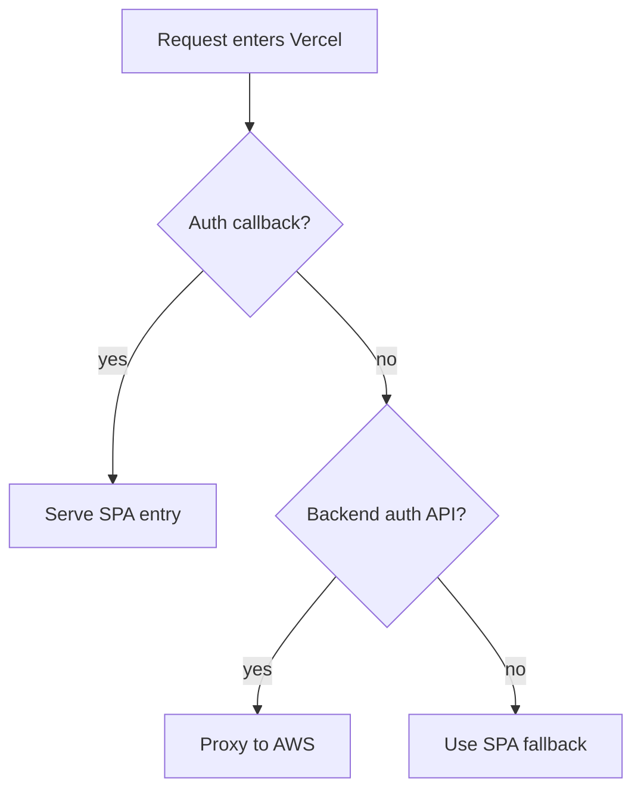

# vercel.json

- File: vercel.json
- Owner: Root deployment surface

## Purpose
Builds the live Vite frontend for Vercel and maps browser paths either to static SPA entry
files or to the AWS backend proxy.

## Route Boundary
`/auth/callback` belongs to the browser app. Supabase returns the OAuth session in the URL
fragment, and fragments never reach the server. The callback rewrite therefore serves
`/index.html` before the broad `/auth/:path*` backend proxy runs.

All operational auth endpoints still proxy to AWS:
- `/auth/google/status`
- `/auth/google/exchange`
- `/auth/onboarding/*`
- `/auth/invite-code/*`
- `/auth/join-request/*`
- legacy login, guest, claim, and session endpoints

## Flow

## Acceptance Checks
- `GET /auth/callback` returns the frontend SPA, not the Express backend 404.
- `GET /auth/google/status` still proxies to the backend.
- Supabase callback URLs keep the browser hash until `GoogleCallback.tsx` exchanges the token.
