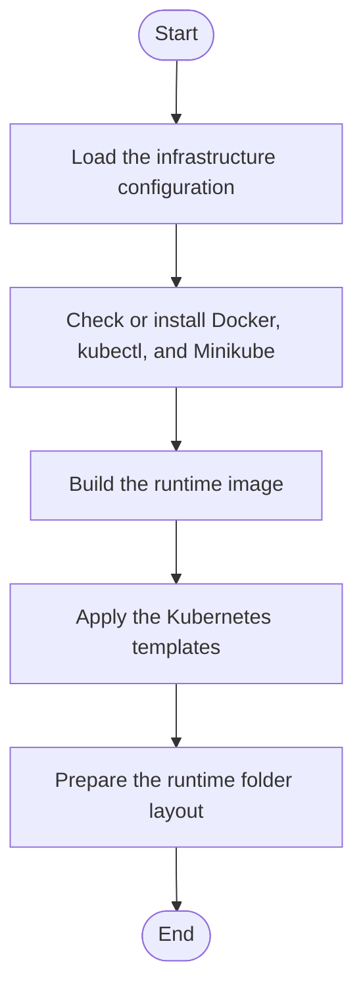

# Session Orchestration Assets

This folder is intentionally decoupled from the C++ source tree and contains only container/orchestration assets for per-user runtime sessions.

## Structure

- `docker/Dockerfile`
- `k8s/templates/user-session-pod.yaml`
- `k8s/templates/user-routing.yaml`
- `installer.config.json`
- `bootstrap_and_deploy.ps1`

## Windows Automation (PowerShell)

Use the bootstrap script to install dependencies, start Kubernetes, build the image, deploy templates, and prepare runtime I/O layout.

From repo root:

```powershell
.\setup.ps1
```

Direct call with config override:

```powershell
.\Infrastructure\session-orchestration\bootstrap_and_deploy.ps1 -ConfigPath .\Infrastructure\session-orchestration\installer.config.json
```

Common overrides:

```powershell
.\setup.ps1 -UserId student42 -Image neoterritory:v1
```

Skip selected phases when tools are already installed:

```powershell
.\setup.ps1 -SkipDependencyInstall -SkipDockerStart
```

Legacy WSL-only tool install (previous behavior):

```powershell
.\setup.ps1 -LegacyWslToolsInstall
```

## Template Variables

- `{{user_id}}`: unique user/session id managed by your Manager API.
- `{{image}}`: container image reference built from `docker/Dockerfile`.

## Notes

- `user-session-pod.yaml` is a single-Pod template with:
  - `activeDeadlineSeconds: 3600`
  - `resources.requests`: `cpu: "1"`, `memory: "2Gi"`
  - `resources.limits`: `cpu: "2"`, `memory: "4Gi"`
- `user-routing.yaml` provides:
  - one dedicated ClusterIP Service per `user_id`
  - one dedicated Ingress path: `/session/{{user_id}}`
- No Deployment or ReplicaSet resources are included.

<!-- AUTO-IMPLEMENTATION-STORY-START -->

## Implementation Story
This README describes the implemented environment bring-up path rather than a single function. The corresponding code lives in the PowerShell bootstrap script, the runtime-layout script, the Dockerfile, and the Kubernetes templates, and together they move the system from a bare machine to a runnable NeoTerritory session environment.

## Activity Diagram


<!-- AUTO-IMPLEMENTATION-STORY-END -->

