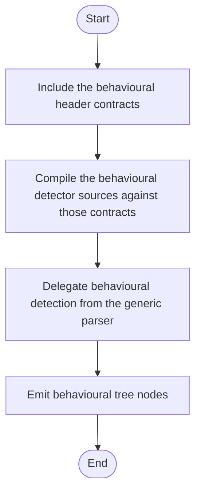

# Behavioural Detection Format (Header Index)

Implementation and rule details are documented in:

- `Project/Modules/Source/Behavioural/DETECTION_FORMAT.md`

Public APIs related to detection:

- `build_behavioural_broken_tree(...)`
- `build_behavioural_broken_tree(..., const IBehaviouralTreeCreator&, const std::vector<const IBehaviouralDetector*>&)`
- `build_behavioural_function_scaffold(...)`
- `build_behavioural_structure_checker(...)`
- `IBehaviouralDetector`
- `IBehaviouralTreeCreator`

<!-- AUTO-IMPLEMENTATION-STORY-START -->

## Implementation Story
This header-oriented detection format document corresponds to the compile-time contract of the behavioural subsystem. The implementation story begins with these declarations, continues into the behavioural detector sources, and ends when the generic parser delegates behavioural structure checks through those interfaces.

## Activity Diagram

<!-- AUTO-IMPLEMENTATION-STORY-END -->

