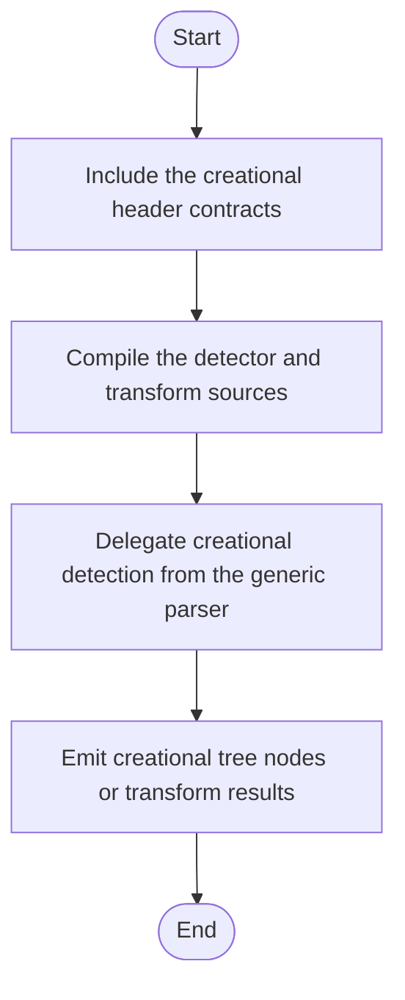

# Creational Detection Format (Header Index)

Implementation and rule details are documented in:

- `Project/Modules/Source/Creational/DETECTION_FORMAT.md`

Public APIs related to detection:

- `build_creational_broken_tree(...)`
- `build_creational_broken_tree(..., const ICreationalTreeCreator&, const std::vector<const ICreationalDetector*>&)`
- `build_factory_pattern_tree(...)`
- `build_singleton_pattern_tree(...)`
- `build_builder_pattern_tree(...)`
- `check_builder_pattern_structure(...)`
- `ICreationalDetector`
- `ICreationalTreeCreator`

<!-- AUTO-IMPLEMENTATION-STORY-START -->

## Implementation Story
This header-oriented detection format document corresponds to the compile-time contract of the creational subsystem. The implementation it describes starts with detector and transform declarations in the headers and then continues in the creational source files that build detector trees and perform rewrites.

## Activity Diagram

<!-- AUTO-IMPLEMENTATION-STORY-END -->

