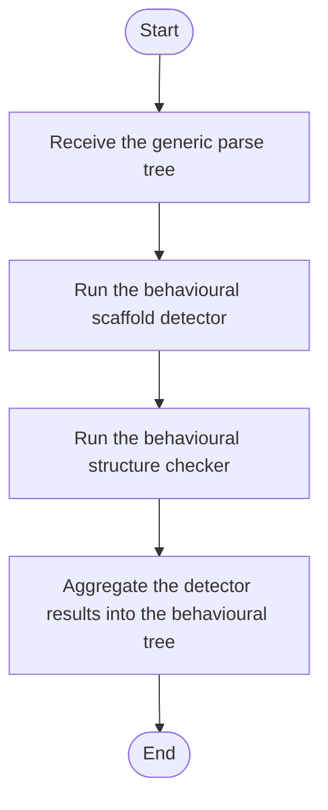

# Behavioural Detection Format

## Current Ownership

- Behavioural pattern detection is owned by the **Behavioural** module.
- Behavioural structural keyword hooks are owned by:
  - `Modules/Header/Behavioural/Logic/behavioural_structural_hooks.hpp`
  - `Modules/Source/Behavioural/Logic/behavioural_structural_hooks.cpp`
- `SyntacticBrokenAST` no longer implements strategy/observer keyword rules; it only delegates to Behavioural hook providers.

## Detector Composition

Default composition remains under `behavioural_broken_tree.cpp`:

1. Function scaffold detector
2. Behavioural structure checker detector

Output roots and node kinds remain:

- `BehaviouralPatternsRoot`
- `BehaviouralEntryRoot`
- `BehaviouralStructureCheckRoot`
- `FunctionNode`
- `ClassNode`
- `StrategyInterfaceCandidate`
- `StrategyContextCandidate`
- `ObserverSubjectCandidate`
- `ObserverListenerCandidate`

## Structural Hook Contract

`resolve_behavioural_structural_keywords(...)` provides source-pattern keyword sets for:

- `strategy` -> `StrategyStructuralStrategy`
- `observer` -> `ObserverStructuralStrategy`

The lexical parser applies these keywords generically and records matched classes into `CrucialClassInfo`.

## Non-Ownership Clarification

Behavioural module does not own creational transforms (singleton/builder/factory rewrites). Those are owned by `Creational/Transform`.

<!-- AUTO-IMPLEMENTATION-STORY-START -->

## Implementation Story
This source-oriented behavioural format document corresponds directly to the behavioural implementation files. The code path it describes begins once a generic parse tree already exists, then runs the scaffold and structural checks, and finally contributes a behavioural broken-tree view back to the pipeline.

## Activity Diagram

<!-- AUTO-IMPLEMENTATION-STORY-END -->

