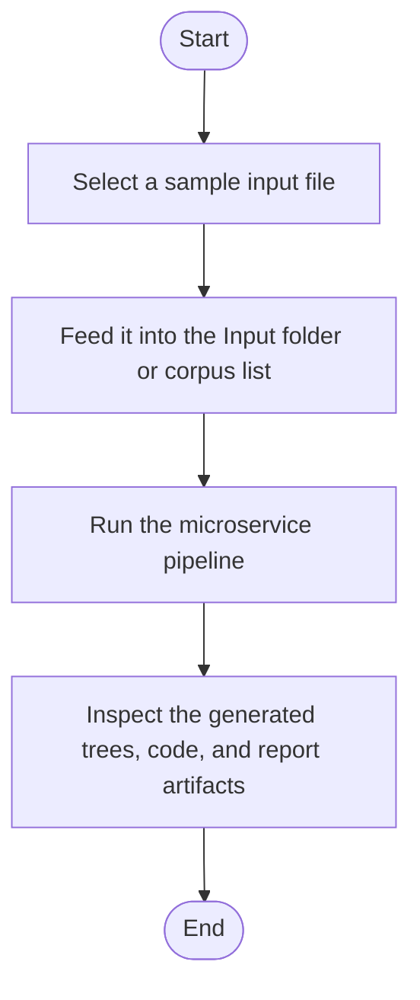

# Sample Analysis Inputs

Use these files as CLI input for the static analysis pipeline:

- `factory_to_singleton_source.cpp`: contains factory + singleton pattern candidates.
- `factory_to_base_instance_source.cpp`: factory instance-call regression for `factory -> base` (assignment-form callsite).
- `factory_to_base_kind_numeric_source.cpp`: numeric literal exact-match regression for `factory -> base` (`kind == 1`, `create(1)`).
- `factory_to_base_identifier_literal_source.cpp`: identifier literal exact-match regression for `factory -> base` (`kind == zero`, `create(zero)`).
- `factory_to_base_unresolved_instance_source.cpp`: unresolved factory instance typing regression for `factory -> base`.
- `factory_to_base_non_literal_source.cpp`: non-literal argument regression for `factory -> base`.
- `singleton_to_factory_source.cpp`: contains singleton pattern candidates (`source_pattern=singleton`, `target_pattern=factory`).
- `singleton_to_builder_source.cpp`: contains singleton pattern candidates (`source_pattern=singleton`, `target_pattern=builder`).
- `builder_to_singleton_source.cpp`: contains builder pattern candidates (`source_pattern=builder`, `target_pattern=singleton`).
- `domain_models_source.cpp`: contains non-pattern domain classes (`Driver`, `FleetVehicle`, `Trip`) for context.

## Expected outputs after running

- `parse_tree.html`
- `creational_parse_tree.html`
- `behavioural_broken_ast.html`
- `generated_base_code.cpp`
- `generated_base_code.html`
- `generated_target_code_<target_pattern>.cpp`
- `generated_target_code_<target_pattern>.html`
- `analysis_report.json`

The non-pattern domain classes are included only as context and should not be the main target of creational pattern detection.

<!-- AUTO-IMPLEMENTATION-STORY-START -->

## Implementation Story
This README documents the regression corpus that feeds the implemented microservice. The corresponding code story starts when one of these sample files is copied into the runtime Input folder and ends when the parser, detectors, and generators produce HTML, code, and JSON outputs describing what the sample triggered.

## Activity Diagram

<!-- AUTO-IMPLEMENTATION-STORY-END -->

